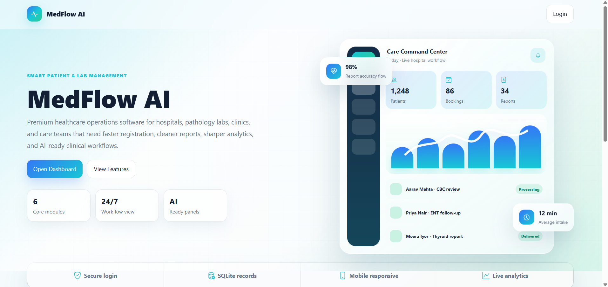
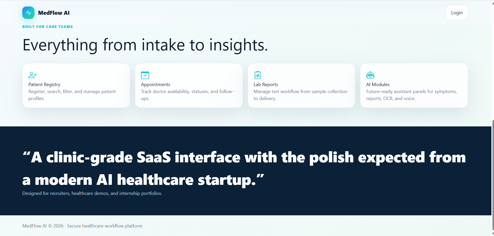
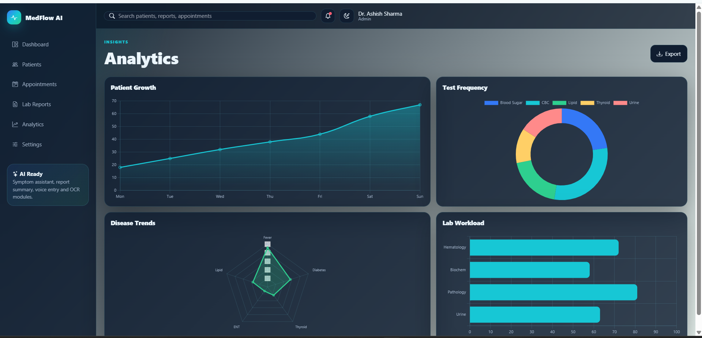

# MedFlow AI

MedFlow AI is a modern healthcare SaaS web application for hospitals, clinics, pathology labs, and healthcare centers. It helps staff register patients, manage appointments, track lab reports, view analytics, and explore future-ready AI workflow modules.

The project is designed as a professional portfolio app for internship interviews, recruiter review, LinkedIn demos, and healthcare software presentations.

## Demo Login

- Email: `admin@medflow.ai`
- Password: `medflow123`

## Features

- Secure login with hashed passwords and Flask sessions
- Responsive dashboard with animated counters and Chart.js analytics
- Patient management with search, filters, modal forms, and patient detail pages
- Appointment booking with manual patient entry and doctor dropdown selection
- Weekly appointment calendar with status cards and doctor availability
- Lab report management with report cards, statuses, and progress indicators
- Analytics page with patient growth, test frequency, disease trends, and workload charts
- Settings page with profile, notification, security, and theme controls
- AI-ready tools page for symptom assistant, report summary, voice input, OCR scanner, and chatbot workflow
- Dark mode and mobile-responsive sidebar navigation

## Tech Stack

Frontend:

- HTML
- CSS
- JavaScript
- Tailwind CSS CDN
- Bootstrap Icons
- Chart.js

Backend:

- Python
- Flask
- SQLite
- Werkzeug password hashing
- Gunicorn for production

## App Pages

- Landing page
- Login page
- Dashboard
- Patient management
- Patient details
- Appointment system
- Lab reports
- Analytics
- AI tools
- Settings

## Project Structure

```text
MEDFLOW BY ASHISH/
|-- app.py
|-- requirements.txt
|-- Procfile
|-- runtime.txt
|-- render.yaml
|-- static/
|   |-- css/
|   |   `-- styles.css
|   `-- js/
|       `-- app.js
`-- templates/
    |-- base.html
    |-- landing.html
    |-- login.html
    |-- dashboard.html
    |-- patients.html
    |-- patient_detail.html
    |-- appointments.html
    |-- lab_reports.html
    |-- analytics.html
    |-- ai_tools.html
    `-- settings.html
```

## Run Locally

Create a virtual environment:

```powershell
python -m venv .venv
```

Activate it:

```powershell
.\.venv\Scripts\Activate.ps1
```

Install dependencies:

```powershell
pip install -r requirements.txt
```

Start the app:

```powershell
python app.py
```

Open:

```text
http://127.0.0.1:5000
```

The SQLite database is created automatically on first run with sample healthcare data.

## Screenshots

### Homepage





### Authentication


### Dashboard


### Patient Management


### Appointment System


### Lab Reports


### Analytics



### AI Module


## Deploy on Render

This repository includes Render deployment files:

- `Procfile`
- `runtime.txt`
- `render.yaml`

Render settings:

- Build command: `pip install -r requirements.txt`
- Start command: `gunicorn app:app`
- Environment variable: `SECRET_KEY`

## Future Improvements

- PDF lab report generation
- Email report delivery
- QR code patient ID
- Role-based dashboards for Admin, Doctor, Lab Technician, and Receptionist
- Real OpenAI-powered symptom assistant and report summary
- Calendar drag-and-drop scheduling
- REST API endpoints for mobile apps

## Author

Built by Ashish as a modern healthcare management portfolio project.
